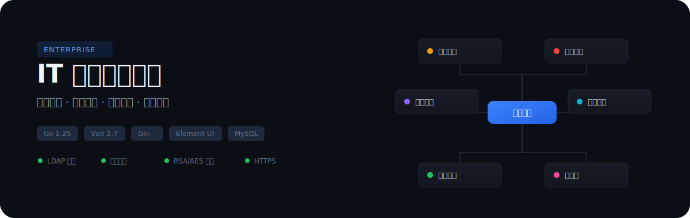

<p align="center">
  
</p>

一站式企业 IT 运维管理平台。将资产台账、安全合规、权限治理、变更审批和团队协作整合到同一个系统中，通过 LDAP 统一认证和双控审批机制确保每一次关键操作可追溯、可控制。

## 核心能力

| 模块 | 说明 |
|------|------|
| 资产管理 | IT 资产全生命周期管理，关联区域 / OS 类型，数据看板汇总关键指标 |
| 安全合规 | 漏洞扫描、渗透测试、防火墙检查、系统加固、补丁更新、备份管理，形成闭环台账 |
| 权限治理 | LDAP 域控认证、岗位权限配置、月度 / 季度检查、用户变更审计 |
| 变更管理 | 变更创建 / 审批 / 归档，自定义变更类型，模板与扫描件管理 |
| 双控审批 | 关键写操作需第二人验证，防止单人误操作 |
| 协作与知识 | 多视图日历、步骤式 IT 指南（图文 / 视频）、表单发布、AES 加密密码本 |
| 审计日志 | 登录日志 + 操作日志，全链路可追溯 |

## 安全机制

- **JWT 双 Token** — Access Token (短期) + Refresh Token (长期)，无感刷新
- **RSA 加密传输** — 登录密码公钥加密，后端私钥解密
- **配置文件加密** — 敏感配置以 `ENC[base64]` 格式存储，启动时 RSA-OAEP 自动解密
- **双控审批** — 关键写操作需第二人验证
- **AES 密码本** — 敏感密码加密存储，按需解锁，查看留痕
- **HTTPS** — 全站 TLS 加密通信
- **LDAP 集成** — 企业 AD 域控单点登录

## 快速开始

**环境要求：** Go 1.25+ · Node.js + npm · MariaDB 11.8+

```bash
# 1. 后端
cd server
vim config.yml          # 配置数据库、LDAP、TLS、加密密钥路径
go mod download
go build -o it-server . && ./it-server

# 2. 前端
cd client
npm install
npm run serve           # 开发模式 (https://localhost:8080)
npm run build           # 生产构建 → client/dist/
```

**部署：** 后端交叉编译为 Linux 二进制 `GOOS=linux GOARCH=amd64 go build -o it-server-linux .`，前端产物部署至 Nginx 静态服务器。

## 技术栈

| 层级 | 技术 |
|------|------|
| 前端 | Vue 2.7 · Element UI · Vue Router · Axios · ECharts · anime.js · node-forge · docx-preview · xlsx |
| 后端 | Go 1.25 · Gin · GORM · golang-jwt · go-ldap · excelize · RSA/AES |
| 数据库 | MySQL / MariaDB |
| 部署 | HTTPS (TLS) · 交叉编译 Linux 二进制 · Nginx 反向代理 |

## 项目结构

```
IT/
├── client/                          # 前端 (Vue 2 + Element UI)
│   ├── public/
│   │   ├── fonts/                   # 自定义字体文件
│   │   ├── favicon.ico
│   │   └── index.html
│   ├── src/
│   │   ├── api/                     # API 请求模块 (按业务拆分，共 32 个)
│   │   │   ├── request.js           #   Axios 实例 & 拦截器 (管理端)
│   │   │   ├── auth.js              #   登录 / Token 刷新
│   │   │   ├── dualControl.js       #   双控验证
│   │   │   ├── asset.js             #   资产管理
│   │   │   ├── calendar.js          #   日程管理
│   │   │   ├── password_vault.js    #   密码本
│   │   │   ├── it_guide.js          #   IT指南
│   │   │   ├── form_vault.js        #   表单发布
│   │   │   ├── public_form.js       #   公开表单下载
│   │   │   └── ...                  #   其余业务模块 API
│   │   ├── components/              # 公共组件
│   │   │   ├── DualControlDialog.vue#   双控验证弹窗
│   │   │   ├── NotificationBell.vue #   日程通知铃铛
│   │   │   └── SvgIcon.vue          #   SVG 图标组件
│   │   ├── router/
│   │   │   └── index.js             # 路由配置 (管理端 + 公开端)
│   │   ├── styles/                  # 全局样式
│   │   │   ├── dialog-theme.css     #   弹窗主题
│   │   │   ├── fonts.css            #   字体声明
│   │   │   ├── header-theme.css     #   顶栏主题
│   │   │   └── sidebar-theme.css    #   侧边栏主题
│   │   ├── utils/
│   │   │   └── rsa.js               # 前端 RSA 加密工具 (node-forge)
│   │   ├── views/                   # 页面视图 (按模块划分)
│   │   │   ├── Layout.vue           #   管理端主布局 (顶栏+侧边栏+内容区)
│   │   │   ├── login/               #   登录页
│   │   │   ├── dashboard/           #   数据看板 (ECharts)
│   │   │   ├── asset/               #   资产管理
│   │   │   ├── region/              #   区域管理
│   │   │   ├── ostype/              #   操作系统管理
│   │   │   ├── network-security/    #   网络安全 (漏洞扫描/渗透/防火墙/变更/整改)
│   │   │   ├── system-security/     #   系统安全 (加固/补丁/病毒/备份)
│   │   │   ├── permission/          #   岗位权限 & 月度检查 & 用户变更
│   │   │   ├── user-permission/     #   用户权限一览 & 部门管理
│   │   │   ├── sftp/                #   SFTP 账号管理
│   │   │   ├── approved-software/   #   核准软件 & 资产对应 & 季度检查
│   │   │   ├── dedicated-line/      #   专线信息
│   │   │   ├── ipsec-vpn/           #   IPsec VPN 管理
│   │   │   ├── policy/              #   IT 政策文档
│   │   │   ├── topology/            #   网络拓扑图
│   │   │   ├── calendar/            #   日程管理 (月/周/日视图)
│   │   │   ├── it-guide/            #   IT指南 (管理端)
│   │   │   ├── form-publish/        #   表单发布
│   │   │   ├── password-vault/      #   密码本
│   │   │   ├── log/                 #   登录日志 & 操作日志
│   │   │   └── public/              #   公开端 (表单下载/IT指南浏览)
│   │   ├── App.vue
│   │   └── main.js
│   ├── vue.config.js                # Vue CLI 配置 (代理/HTTPS)
│   └── package.json
│
├── server/                          # 后端 (Go / Gin / GORM)
│   ├── config/
│   │   └── config.go                # 配置加载 & ENC[] 字段 RSA 解密
│   ├── database/
│   │   ├── database.go              # 数据库连接初始化 (GORM AutoMigrate)
│   │   └── seed.go                  # 种子数据
│   ├── handlers/                    # HTTP 处理器 (按业务拆分，共 35 个)
│   │   ├── auth.go                  #   登录 / Token 刷新 / 登出
│   │   ├── rsa.go                   #   RSA 公钥下发 & 密码解密
│   │   ├── dual_control.go          #   双控验证
│   │   ├── asset.go                 #   资产 CRUD
│   │   ├── dashboard.go             #   看板统计
│   │   ├── calendar.go              #   日程管理
│   │   ├── password_vault.go        #   密码本
│   │   ├── it_guide.go              #   IT指南
│   │   ├── form_vault.go            #   表单发布
│   │   ├── audit_log.go             #   审计日志
│   │   ├── export_*.go              #   导出功能 (变更记录/确认表)
│   │   ├── form_cross_module.go     #   跨模块表单引用
│   │   ├── form_dynamic_generators.go#  动态表单生成器
│   │   └── ...                      #   其余业务处理器
│   ├── middleware/
│   │   ├── cors.go                  # 跨域中间件
│   │   ├── jwt.go                   # JWT 认证中间件
│   │   └── dual_control.go          # 双控审批中间件
│   ├── models/                      # 数据模型 (GORM Model，共 25+ 个)
│   │   ├── asset.go                 #   资产
│   │   ├── change_record.go         #   变更记录
│   │   ├── password_vault.go        #   密码本
│   │   ├── calendar.go              #   日程
│   │   ├── audit_log.go             #   审计日志
│   │   └── ...                      #   其余数据模型
│   ├── routes/
│   │   └── router.go                # 路由注册 (公开/JWT/双控 三级分组)
│   ├── services/                    # 业务服务层
│   │   ├── audit_log.go             #   操作日志记录服务
│   │   └── calendar.go              #   日程通知服务
│   ├── certificate/                 # TLS & RSA 证书
│   │   ├── server.crt / server.key  #   HTTPS 证书
│   │   ├── ca.crt                   #   LDAP CA 证书
│   │   └── rsa_private/public.pem   #   登录密码加解密密钥对
│   ├── key/                         # 配置文件加密密钥对
│   │   ├── config-key.pem           #   配置解密私钥
│   │   └── config-key.pub.pem       #   配置加密公钥
│   ├── assets/                      # 静态资源 (导出文件 Logo)
│   ├── uploads/                     # 文件上传存储 (按模块分子目录)
│   │   ├── policies/                #   IT 政策文件
│   │   ├── topologies/              #   网络拓扑图
│   │   ├── vulnerability_scans/     #   漏洞扫描报告
│   │   ├── change_records/          #   变更记录扫描件
│   │   ├── form_vault/              #   表单发布文件
│   │   ├── it_guide_media/          #   IT指南媒体资源
│   │   ├── dedicated_lines/         #   专线图片
│   │   ├── ipsec_vpn/               #   IPsec 附件
│   │   └── ...                      #   其余上传目录
│   ├── config.yml                   # 主配置文件 (敏感字段 ENC[] 加密)
│   ├── go.mod
│   └── main.go                      # 入口 (配置→RSA→DB→路由→启动)
│
└── assets/readme/                   # README 资源
    └── hero.svg
```

## 功能清单

<details>
<summary>基础设施管理</summary>

- 区域管理 — 数据中心 / 办公区域
- 操作系统管理 — OS 类型字典维护
- 资产管理 — CRUD + 关联区域 / OS 类型
- 数据看板 — 资产、安全、权限关键指标汇总
</details>

<details>
<summary>安全合规</summary>

- 漏洞扫描 — 扫描记录、整改报告上传、闭环追踪
- 渗透测试 — 报告上传与管理
- 防火墙检查 — 检查记录与整改报告
- 系统加固 — 加固检查表导出与历史记录
- 补丁更新 — 补丁记录与合规性报表
- 备份管理 — 备份申请、恢复还原、模板管理
</details>

<details>
<summary>身份与权限治理</summary>

- LDAP 统一认证 — 企业 AD 域控单点登录
- 双 Token 无感刷新 — Access + Refresh Token
- 双控审批 — 关键写操作第二人验证
- 岗位权限设置 — 基于岗位的权限规则配置
- 用户权限一览 — 全量权限查看与导出
- 月度 / 季度检查历史 — 权限定期确认
- 用户变更记录 — 权限变更审计追踪
</details>

<details>
<summary>变更管理</summary>

- 变更记录创建 / 审批 / 归档
- 变更类型自定义与排序
- 变更模板管理（上传 / 下载 / 预览）
- 变更记录扫描件管理
</details>

<details>
<summary>协作与知识</summary>

- 日程管理 — 月 / 周 / 日多视图、重复日程、冲突检测
- IT 指南 — 步骤式操作指南，图文 / 视频，公开访问
- 表单发布 — 上传 / 发布 / 公开下载，跨模块引用
- 密码本 — AES 加密、分类管理、收藏排序、查看审计
</details>

<details>
<summary>其他</summary>

- SFTP 服务器 / 账号管理
- 核准软件目录与资产对应表
- IT 政策文档管理
- 网络拓扑图管理
- 审计日志（登录 + 操作）
</details>

---

Private — Internal Use Only
